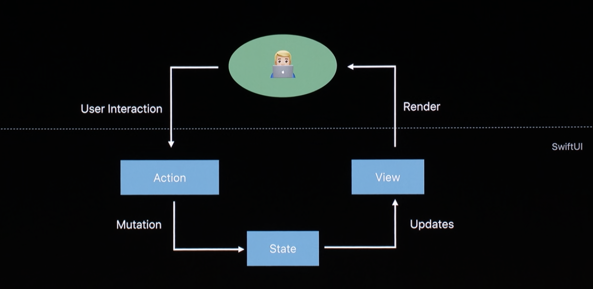

1-example-podcastplayer-on-watch.md


## [Example: PodcastPlayer on Watch](1-example-podcastplayer-on-watch.md) [4:32]


```swift
struct PlayerView : View {

    let episode : Episode
    @State private var isPlaying : Bool = false


}


```


### @State Property Wrapper


### Anatomy of a View Update


Every @State is a source of truth.

Views are a function of state, not of sequence of events.




#### Abstract a PlayButton out (12:30-)


```swift

struct PlayButton : View {

    @Binging var isPlaying : Bool = false // was @State private


}


```


### @Binding Property Wrapper (13:00-)

- read and write without ownership
- Derivable from @State (of this view's parent.)

Really? You don't need ViewController any more?

Example of built-in Views to using Binding (15:50-)

- Toggle - Bool
- TextField - String
- Slider - BinaryFloatingPoint


```swift
// Animated Changes
Button(action: {
    withAnimation { self.isPlaying.toggle() }
}){

}

```

Use site


```swift


PlayButton(isPlaying: $isPlaying)


```